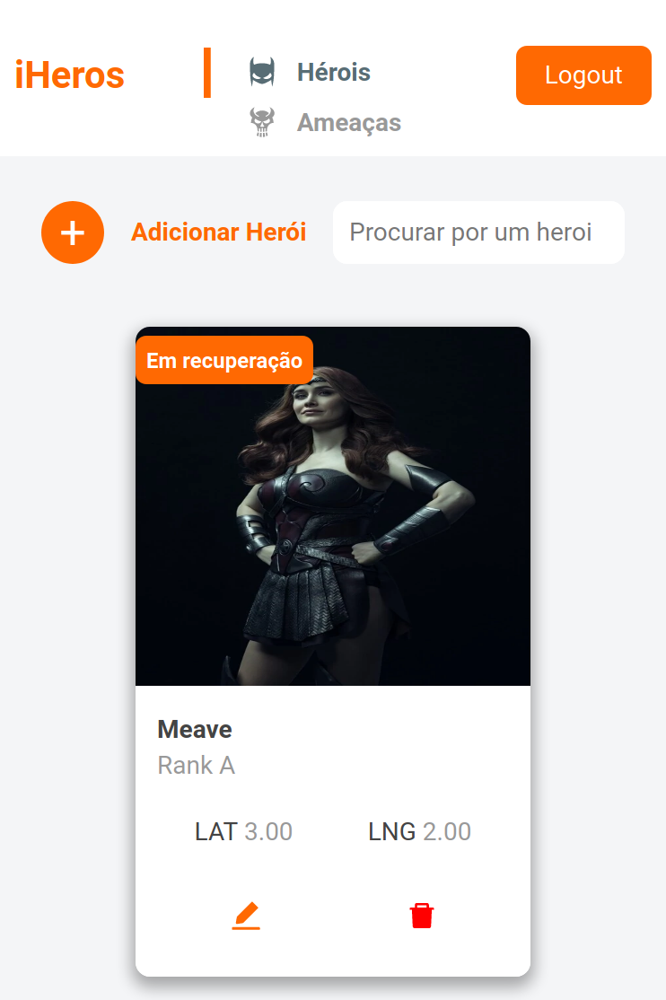

<p align="center">
   
</p>

# iHeroes


[](https://github.com/Arthurgallina1)

> iHeroes is an responsive heros distribution management system to combat threats. The system should monitor the threat alert system provided by the UN and allocate heroes for each new threat on the globe. 

It's important to mention that this is an assignment for a job application **only**.

---

# :postbox: Techs

The tecnologies used in this project are: 
* [React](https://pt-br.reactjs.org/) 
* [SCSS](https://sass-lang.com/)
* Node.js 
* Express
* MongoDB
* Docker

**Even tho this is clearly a relational data modeling, MongoDB was chosen due its flexibility, providing a easy and fast way to make changes into the data modeling, also because of its robust native API
to work with Coordinates and Point types.**


# :eyeglasses: Preview
<p></p>
 &nbsp;&nbsp;&nbsp;&nbsp;&nbsp;&nbsp;
</p>


# :rocket: Features

* Authentication
* Register, edit, remove and list heroes
* Automatically allocate the most appropriate hero when a new threat appears.
* Record a hero's deallocation (means deallocation, the hero's act having already defeated the threat, after he has been allocated).
* View the threat history along with who was responsible for preventing the catastrophe.

# :construction_worker: Installation

**You need to install [Node.js](https://nodejs.org/en/download/), [Yarn](https://yarnpkg.com/) and [Docker](https://docs.docker.com/compose/) and then clone the project via HTTPS, running this command:**

```git clone https://github.com/Arthurgallina1/iHeros.git```

**Change your directory to the root folder**

```cd iHeros/```

**Then, to start the backend, in the root folder run:**

```sudo docker-compose up --build```

Wait until it's done and the backend is all set.

**Now, open a new terminal and change to frontend/ folder and install dependencies by running the command:**

```yarn```

**Run the following command in the frontend/ folder order to start the application locally:**

```
  yarn start
```

# :runner: Getting Started

Run the following command in the frontend/ folder order to start the application locally:

```
  yarn start
```

# :closed_book: License

Released in 2020.
This project is under the MIT license.
